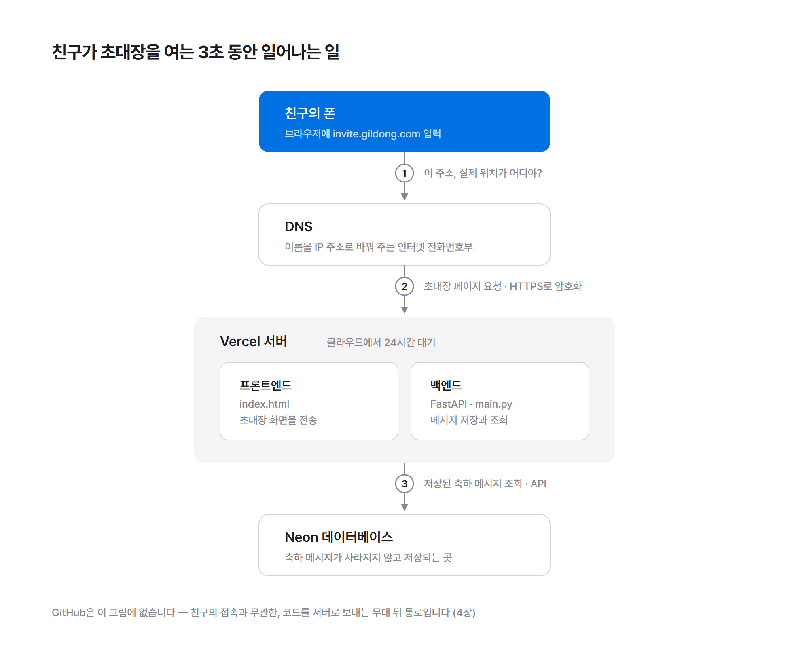

<div align="center">


# 바이브코딩, 배포까지 완주

**AI가 코드는 다 짜줍니다.<br/>이 책은 당신이 AI에게 "배포해줘"라고 제대로 시킬 수 있는 사람으로 만들어줍니다.**

[](https://wikidocs.net/book/20726)
[](https://wikidocs.net/book/20726)
[](#-목차)

<a href="https://wikidocs.net/book/20726"><b>📖 wikidocs.net/book/20726</b></a>

</div>

---

## 어떤 책인가요

AI에게 시켜서 웹페이지 하나쯤 만들어 본 적, 있으시죠? 화면에 뜨는 것까지는 성공했는데 — 그다음이 문제였을 겁니다.

> "이거 친구한테 어떻게 보내요?" → 링크가 `localhost:8000`인데, 친구 폰에서는 안 열립니다.
> "배포하면 된대요" → 배포가 뭔가요?
> "도메인 연결하래요" → ...조용히 창을 닫습니다.

여기서 멈추는 이유는 실력이 아니라 **어휘**입니다. 배포, 서버, DNS 같은 단어를 모르면 AI에게 질문 자체를 만들 수가 없으니까요. 이 책은 코딩을 가르치지 않습니다. 코드는 지금까지처럼 AI가 짭니다. 대신 이 책은 그 코드를 **세상에 내보내는 데 필요한 단어와 질문**을 드립니다 — localhost에서 출발해, 내 도메인 주소가 걸린 서비스를 카톡으로 보내는 순간까지.

## 이런 분을 위해 썼습니다

- AI(Claude, ChatGPT 등)로 뭔가 만들어는 봤는데 **localhost 밖으로 나가본 적이 없는** 분
- 파이썬 문법? **몰라도 됩니다.** 코드는 AI가 짜고, 책은 프롬프트를 드립니다
- 클라우드 요금 폭탄이 무서운 분 — 이 책의 경로에는 **신용카드 등록 단계가 아예 없습니다**

## 완주하면 얻는 것

하나의 프로젝트(모임 초대장 + 방명록)를 처음부터 끝까지 키워가며, 세 번의 "와" 포인트를 지납니다.

| | 순간 | 배우는 것 |
|---|---|---|
| 1 | `*.vercel.app` 주소가 내 폰에서 열린다 | GitHub · Vercel · 자동 배포(CI/CD) |
| 2 | 친구가 남긴 축하 메시지가 안 사라진다 | 서버리스 · stateless · Neon(PostgreSQL) |
| 3 | `https://내이름.com` 으로 초대장이 열린다 | 도메인 구매 · DNS · HTTPS 자동 발급 |

마지막 장에서는 도메인 하나로 서브도메인을 무한히 만드는 **"나만의 놀이터"** 루틴까지. 총비용은 도메인 값(연 1.5만~2.5만 원)이 전부입니다.

<div align="center">

<br/><sub>본문 다이어그램 예시 — 2.4 「이 그림 하나만 기억하세요」</sub>
</div>

## 목차

| 장 | 제목 |
|---|---|
| 01 | 당신이 localhost에서 멈추는 진짜 이유 |
| 02 | 딱 필요한 만큼의 용어 사전 — 큰 그림 잡기 |
| 03 | AI에게 시켜서 만들기 — 나만의 초대장 |
| 04 | GitHub — 내 코드를 배포 컨베이어 벨트에 올리기 |
| 05 | Vercel — push하면 전 세계에 배포되는 마법 |
| 06 | 서버리스 — 배포됐는데 뭔가 이상하다 |
| 07 | Neon — 데이터가 진짜로 저장되는 곳 |
| 08 | 도메인 — 내 이름을 건 주소 사기 |
| 09 | 도메인 연결 — 주소와 서버를 잇는 법 |
| 10 | 서브도메인 — 도메인 하나로 평생 놀기 |
| 11 | 돈 이야기 — 안 무섭게 정리하는 비용 |
| 12 | 완주 — 초대장 보내기 |
| 부록 | A. 프롬프트 전체 모음 · B. 에러별 질문 인덱스 · C. 개발자용 지름길 |

전체 목차와 본문은 [위키독스](https://wikidocs.net/book/20726)에서 읽을 수 있습니다.

## 책의 방식

- 매 절마다 **"Claude에게 이렇게 시키세요"** — 복사해 붙여넣는 실전 프롬프트
- 매 장 끝에 **"이 장에서 만든 것" + "자주 막히는 지점"** 트러블슈팅 박스
- 에러가 나면? **에러 원문을 통째로 AI에게** — 3.6절의 황금 템플릿 하나로 평생 씁니다
- 클라우드 화면 설명은 최소화 — UI는 바뀌므로 "대시보드가 알려주는 값을 받아 적는 법"을 가르칩니다

## 기술 스택

`FastAPI` · `Vercel` (서버리스, 무료) · `Neon` (PostgreSQL, 무료) · `GitHub` · `호스팅케이알` (도메인) · 기준 AI 도구는 `Claude`

## 저장소 구조

```
manuscript/   장별 원고 (chNN/N-M.md, 절 단위)
images/       본문 다이어그램 PNG + 원본 SVG 소스 (src/*.html)
```

## 저작권

이 저장소의 원고와 이미지는 위키독스에 연재·판매 중인 책의 원본입니다. 무단 전재와 재배포를 금합니다.
